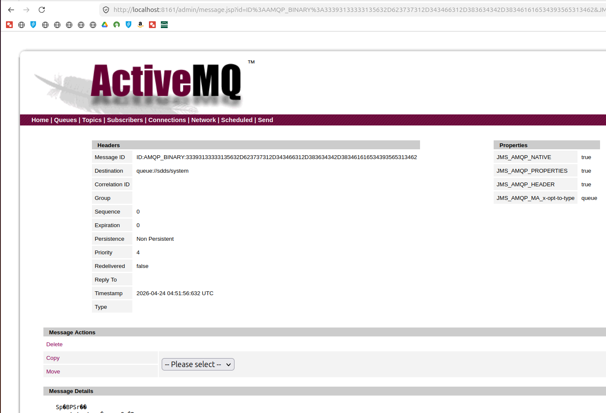

# SDDS (Mayan-DS) User Guide

This guide explains how to use and extend the Software-Defined Data Services (SDDS) framework.

## 1. Overview
Mayan-DS is a middleware for network-aware data services. It operates through three main planes:
- **Control Plane**: Asynchronous coordination via AMQP.
- **Orchestration Plane**: Network-aware service placement.
- **Resilience Plane**: Differentiated QoS and selective redundancy.

---

## 2. Running the Framework
Use the master launcher to start the infrastructure and the framework:
```bash
./sdds_launcher.sh
```
The launcher will:
1. Start an **ActiveMQ Broker** (via Docker) on port `5672`.
2. Build the SDDS integration.
3. Launch the `org.sdds.Main` class.

---

## 3. How to Use the Planes

### Orchestration (Évora)
To schedule a data service based on network costs (latency, throughput), use the `Orchestrator` class:
```java
Orchestrator orchestrator = new Orchestrator();
// Supports services like "inter-domain-sync", "compression", "dedup"
orchestrator.scheduleService("inter-domain-sync");
```
*Configuration*: You can modify the weights (alpha, beta, gamma) in `Orchestrator.java` to favor different QoS metrics (Cost, Latency, Throughput).

### Resilience (SMART)
To protect a data flow when congestion occurs, use the `ResilienceManager`:
```java
ResilienceManager resilience = new ResilienceManager();
// Apply a policy: REPLICATE, CLONE, or DIVERT
resilience.applyPolicy("flow-101", "REPLICATE");
```
*Note*: If `DOMDataBroker` is unavailable, it uses stochastic simulation (randomly detecting congestion) for research parity.

### Control Channel (Messaging4Transport)
The control channel sends asynchronous messages across the system:
```java
ControlChannel control = new ControlChannel();
control.publishControlFlow("sdds/system", "STATE_UPDATE");
```

---

## 4. Monitoring the System
Since the framework uses an external AMQP broker, you can monitor the internal state in real-time:



1. **Web Console**: Visit `http://localhost:8161` (Default login: `admin`/`password`).
2. **Topics**: Watch the following topics for events:
   - `sdds/system`: Initialization and heartbeat.
   - `smart/flow-updates`: Resilience policy enforcements.

---

## 5. Troubleshooting the "Hang"
The framework is designed as a long-running middleware. When you run it, the terminal may not return to the prompt because the Messaging4Transport library maintains active connections.
- **To Stop**: Press `Ctrl+C` to terminate the process.
- **To Exit Automatically**: You can add `System.exit(0);` at the end of `Main.java` if you only want to run it as a one-off demo.

---

## 6. Extending SDDS
To build more complex workflows, you can modify `src/main/java/org/sdds/Main.java` to chain multiple service scheduling and policy enforcement calls together based on your research requirements.
